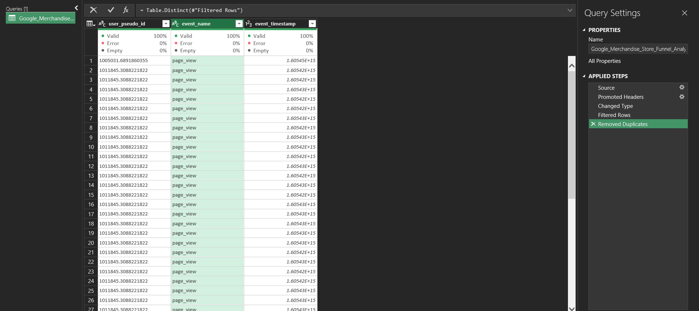
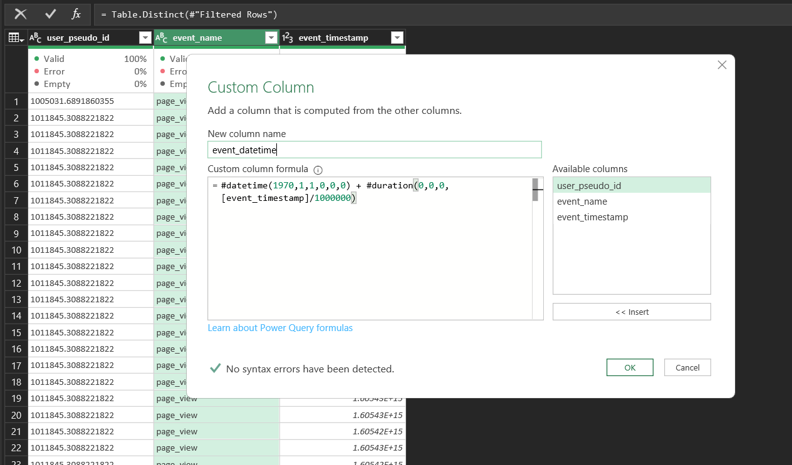
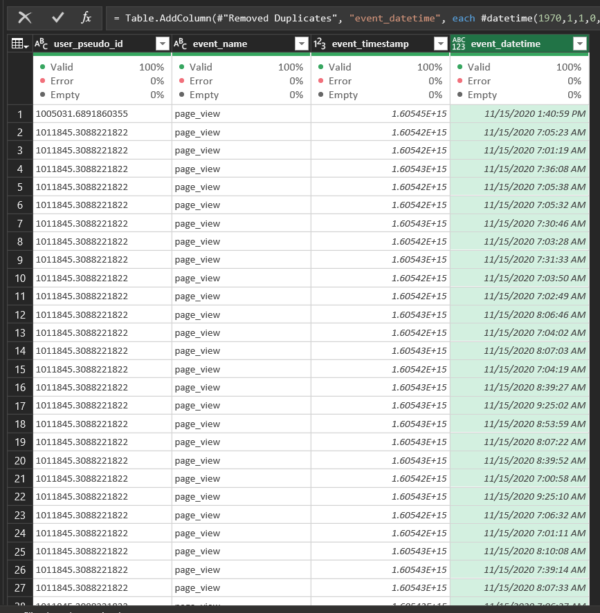
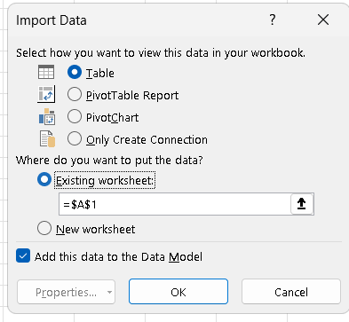
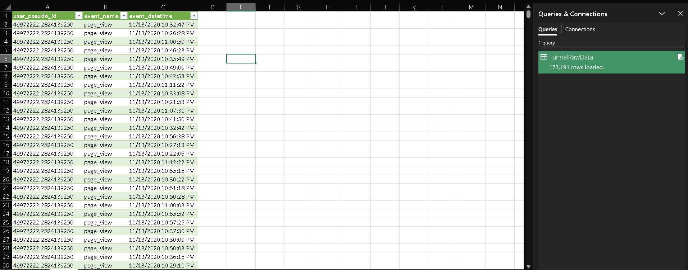
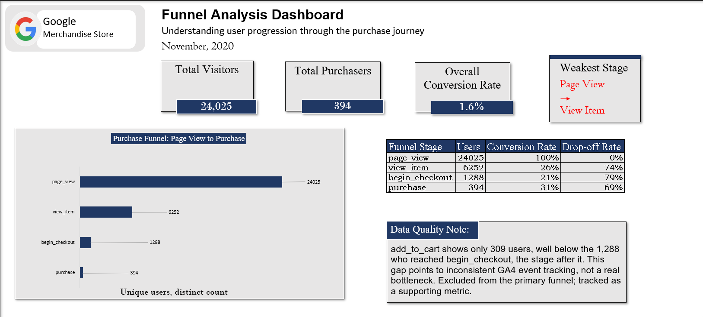

# Purchase Funnel Analysis — Google Merchandise Store

A full-cycle data analytics project tracing the online purchase journey from raw GA4 event data to a finished Excel dashboard, using real ecommerce data from Google's own branded store.

**Author:** Allwell Dediribe
**Tools:** Google BigQuery · Power Query · Power Pivot (DAX) · Excel PivotTables · Excel Dashboard Design

---

## Table of Contents

- [Overview](#overview)
- [Business Problem](#business-problem)
- [Dataset](#dataset)
- [Workflow](#workflow)
  - [1. Data Extraction](#1-data-extraction)
  - [2. Data Cleaning & Preparation](#2-data-cleaning--preparation)
  - [3. Data Analysis](#3-data-analysis)
  - [4. Dashboard Development](#4-dashboard-development)
- [Data Quality Findings](#data-quality-findings)
- [Key Insights](#key-insights)
- [Recommendations](#recommendations)
- [Repository Structure](#repository-structure)
- [How to Reproduce](#how-to-reproduce)
- [Limitations](#limitations)

---

## Overview

This project analyzes the online purchase journey on the **Google Merchandise Store**, using real, event-level GA4 (Google Analytics 4) data pulled directly from Google's public BigQuery dataset. The goal is to trace how many unique visitors make it through each stage of the buying process, from viewing a page to completing a purchase, and to identify where the business loses the most potential customers.

The project follows a complete analytics pipeline: raw data extraction, cleaning, PivotTable and DAX-based analysis, and a single-page Excel dashboard, with findings and recommendations documented separately from the dashboard itself.

---

## Business Problem

Most visitors to an ecommerce site never buy anything. Without knowing exactly where in the journey people drop off, a business can't prioritize where to invest in fixing the experience.

**Business Question:**
> At which stage of the shopping journey do the most users abandon the process, and where should conversion improvements be prioritized?

**Objective:**
Analyze user behavior on the Google Merchandise Store to identify the stage of the purchase journey with the highest drop-off rate, using unique-user counts derived from raw GA4 event data, in order to recommend where the business should prioritize conversion improvements.

---

## Dataset

| | |
|---|---|
| **Source** | [Google BigQuery Public Datasets](https://console.cloud.google.com/bigquery) |
| **Dataset** | `bigquery-public-data.ga4_obfuscated_sample_ecommerce.events_*` |
| **Publisher** | Google (official GA4 sample export) |
| **Access method** | BigQuery Sandbox |
| **Time window analyzed** | November 2020 |
| **Raw rows extracted** | 173,191 event-level rows |
| **Unique users** | 24,034 |

This dataset was chosen over generic pre-cleaned sample files because it is real, unaggregated event data published directly by Google. Every row represents a single action, by a single user, at a single moment in time, which meant the project genuinely started from raw, messy data rather than a file someone else had already cleaned.

### Extraction Query

```sql
SELECT
  user_pseudo_id,
  event_name,
  event_timestamp
FROM `bigquery-public-data.ga4_obfuscated_sample_ecommerce.events_*`
WHERE event_name IN (
  'page_view', 'view_item', 'add_to_cart', 'begin_checkout', 'purchase'
)
AND _TABLE_SUFFIX BETWEEN '20201101' AND '20201130'
```

The raw extract contains three columns:

| Column | Description |
|---|---|
| `user_pseudo_id` | Anonymized, per-device user identifier |
| `event_name` | The action taken (one of five funnel-relevant event types) |
| `event_timestamp` | Microseconds since 1 Jan 1970 (Unix epoch) |

---

## Workflow

### 1. Data Extraction

Data was pulled using **Google BigQuery Sandbox**, a free tier that requires no billing account. The query above was scoped to five funnel-relevant event types across a full calendar month, then exported as CSV.

### 2. Data Cleaning & Preparation

Cleaning was performed in **Power Query** after loading the CSV into Excel:

| Step | Action | Why |
|---|---|---|
| Data type correction | `user_pseudo_id` → Text; `event_timestamp` → Whole Number | Prevents user IDs from being corrupted into scientific notation; correctly types the raw microsecond value |
| Column quality check | Verified all 3 columns at 100% valid, 0% error, 0% empty | Confirms no structural data issues before analysis |
| Event validation | Expanded the `event_name` filter list to confirm exactly 5 distinct values | Ensures no unexpected event types slipped into the extract |
| Duplicate check | Selected all columns → Remove Duplicates | Row count was **173,191 before and after** — confirms zero exact duplicate records |
| Timestamp conversion | Custom column converting Unix microseconds to a readable date/time | Raw GA4 timestamps aren't human-readable by default |



**Timestamp conversion formula:**

```
#datetime(1970,1,1,0,0,0) + #duration(0,0,0,[event_timestamp]/1000000)
```



The cleaned table was loaded into Excel **as a Table, added to the Data Model**. This step is what unlocks **Distinct Count** in PivotTables — without it, only a standard row count is available, which would inflate every funnel stage by counting repeat events instead of unique people.



### 3. Data Analysis

**PivotTable:** `event_name` in Rows, Distinct Count of `user_pseudo_id` in Values. This counts unique *people* per stage, not raw events, since a single user can trigger the same event many times in one session.

**DAX measures** (written in Power Pivot, used to power the dashboard's KPI cards):

```dax
Total Visitors := CALCULATE(
    DISTINCTCOUNT(FunnelRawData[user_pseudo_id]),
    FunnelRawData[event_name] = "page_view"
)

Total Purchasers := CALCULATE(
    DISTINCTCOUNT(FunnelRawData[user_pseudo_id]),
    FunnelRawData[event_name] = "purchase"
)

Overall Conversion Rate := DIVIDE([Total Purchasers], [Total Visitors])
```

These measures are pulled into the dashboard using `Pivot Tables`, allowing KPI cards to display the live values.

**Conversion and drop-off rate**, calculated manually beside the PivotTable:

```
Conversion Rate (stage n) = Users(stage n) / Users(stage n-1)
Drop-off Rate (stage n)   = 1 - Conversion Rate (stage n)
```


### 4. Dashboard Development

A single-page Excel dashboard was built to communicate the findings to someone unfamiliar with the raw data, kept strictly visual and numeric per the project brief (insights and recommendations live in this document, not on the dashboard).

**Dashboard elements:**
- Title and scope line (dataset + time period)
- Four KPI cards: Total Visitors, Total Purchasers, Overall Conversion Rate, Weakest Stage
- Funnel chart (built as a horizontal bar chart with outside-end data labels — Excel's native Funnel chart type couldn't display a label on the very thin `purchase` bar)
- A conversion/drop-off rate table beside the chart
- A short, specific data quality note explaining the `add_to_cart` anomaly



**Workbook structure:**

```
Google_Merchandise_Store_Funnel_Analysis.xlsx
├── Dashboard        → finished visual summary
├── PivotTable        → distinct-count summary + rate calculations
└── FunnelRawData     → cleaned, event-level dataset
```

---

## Data Quality Findings

### The `add_to_cart` Anomaly

During analysis, `add_to_cart` logged only **309** unique users — fewer than the **1,288** unique users who reached `begin_checkout`, a stage that should logically follow `add_to_cart`. A later stage should never out-number an earlier one in a sequential funnel.

**Likely cause:** Inconsistent GA4 client-side event tracking. Some checkout paths (e.g., quick-buy or express-checkout flows) can bypass the standard `add_to_cart` event entirely while still reaching `begin_checkout`.

**Decision:** `add_to_cart` was excluded from the primary sequential funnel and reported separately as a supporting engagement metric, rather than treated as a real behavioral bottleneck.

### Minor Baseline Discrepancy

The PivotTable's Grand Total across all five event types is **24,034** unique users, slightly higher than the `page_view` count used as the funnel's 100% baseline (**24,025**), a difference of 9 users. This indicates a very small number of users triggered a later-stage event without a correspondingly logged `page_view`, consistent with the same class of minor tracking inconsistency seen in `add_to_cart`. At under 0.04% of total users, this does not affect the funnel's shape or conclusions.

---

## Key Insights

The final funnel, based on four sequential stages:

| Funnel Stage | Unique Users | Conversion Rate | Drop-off Rate |
|---|---:|---:|---:|
| `page_view` | 24,025 | 100% | 0% |
| `view_item` | 6,252 | 26% | 74% |
| `begin_checkout` | 1,288 | 21% | 79% |
| `purchase` | 394 | 31% | 69% |

**Overall conversion rate:** 394 ÷ 24,025 = **1.6%**

- Just **1.6%** of visitors complete a purchase.
- The single largest drop-off in the funnel occurs between **page_view and view_item**: 74% of visitors never view a specific product.
- Users who do reach a product page fall off less steeply at later stages (21% and 31% conversion respectively), suggesting the biggest opportunity sits at the very top of the funnel, not further down.
- `add_to_cart` (309 users) is a tracking artifact, not a genuine funnel stage — excluded from the primary analysis for this reason.

---

## Recommendations

1. **Prioritize the page_view → view_item transition first.** This stage accounts for the single largest loss of users of any point in the funnel, making it the highest-leverage fix available.
2. **Review site navigation and product discoverability.** A 74% drop-off before any product is even viewed suggests visitors may be struggling to find, or aren't being directed toward, specific products.
3. **Treat `add_to_cart` as an unreliable metric until resolved.** Future dashboards or reports built on this data should continue tracking it separately rather than as a sequential funnel stage.
4. **Investigate checkout-to-purchase friction as a secondary priority.** This group represents fewer users but stronger intent (they already reached checkout) — targeted fixes such as simplified payment steps may still yield meaningful gains.

These recommendations are intentionally scoped to what this event-level dataset supports. It contains no device, traffic-source, or page-content data, so root-cause diagnosis of *why* the page_view → view_item drop-off happens would require further analysis beyond this project.

---

## Repository Structure

```
├── README.md
├── data/
│   └── funnel_raw_export.csv          # raw BigQuery export (event-level)
├── excel/
│   └── Funnel_Analysis_Dashboard.xlsx # full workbook: raw data, PivotTable, dashboard
├── docs/
│   └── Funnel_Analysis_Documentation.docx  # full written findings (brief-format)
└── presentation/
    └── Funnel_Analysis_Presentation.pptx   # stakeholder-facing summary deck
```

---

## How to Reproduce

1. Enable the **BigQuery API** on a Google Cloud project (Sandbox mode requires no billing account).
2. Run the extraction query above, scoped to your date range of choice.
3. Export results as CSV.
4. In Excel: `Data → Get Data → From File → From Text/CSV` → **Transform Data** to open Power Query.
5. Apply the cleaning steps listed above (data types, duplicate check, timestamp conversion).
6. Load the cleaned table to Excel **with "Add this data to the Data Model" checked.**
7. Build a PivotTable using `event_name` (Rows) and Distinct Count of `user_pseudo_id` (Values).
8. Add the DAX measures via **Power Pivot → Manage → Calculation Area.**
9. Build the four-stage funnel table, conversion/drop-off formulas, and dashboard visuals as described above.

---

## Limitations

- The dataset is a **sample**, not the store's full production traffic, and is obfuscated by Google for public release.
- No device, geography, or traffic-source dimensions were extracted, limiting root-cause analysis of *why* drop-offs occur, only *where*.
- `add_to_cart` tracking is demonstrably incomplete in this dataset and should not be used as a reliable funnel stage without further validation.
-
